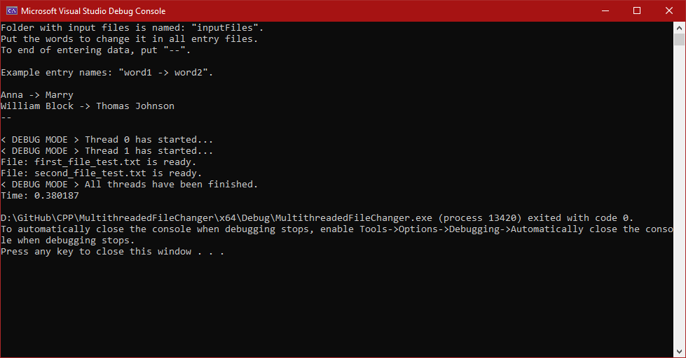
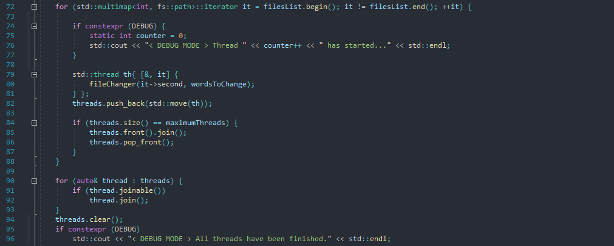

# Multithreaded file changer

> Project allows you to change text sentences on all input files in program's folder "inputFiles". Program enables you to read input file and write to new created file at the same time. 
Program is based on two threads per changed file. First one reads file to buffer, searches text to change and makes changes in them.
When first buffer is full, file is read and changed in second buffer. Therefore, the first buffer is written to new file in other program's internal thread. 
This means that per one open file two new threads are created. Application sorts all input files from the smallest and doesn't allow opening more files than 
half hardware threads (with internal program threads, application occupies maximum all available hardware threads, not more).

## Project assumptions:
* application with fast sequence read and write;
* changes in multiple files at the same time;
* multithread solution for skills improved;

## Project has implemented:
* manage maximum number of running threads, joining them and fast creating new thread when some file is ready;
* sequences read and write with two small buffers for data;
* offsets to find and change data between buffors;

## Application screenshot

## Threads manage - part of the program
Files are sorted by size in multimap associative container. First file with the smallest size probably will finish as first, so this thread will join first. After joining, new thread
may be added and run without cross threads limit. 

## Requirements:
* C++ 17

## Contact
Created by Mateusz Łyszkiewicz  
mat.lyszkiewicz@gmail.com
